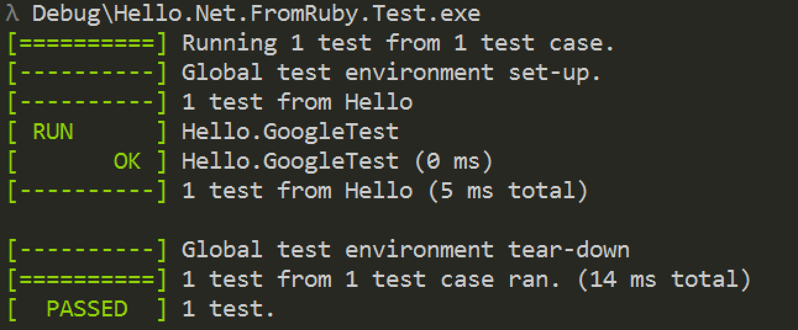
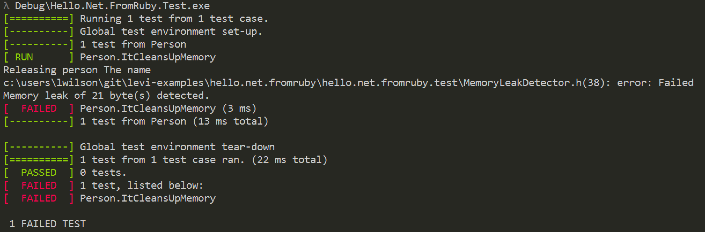
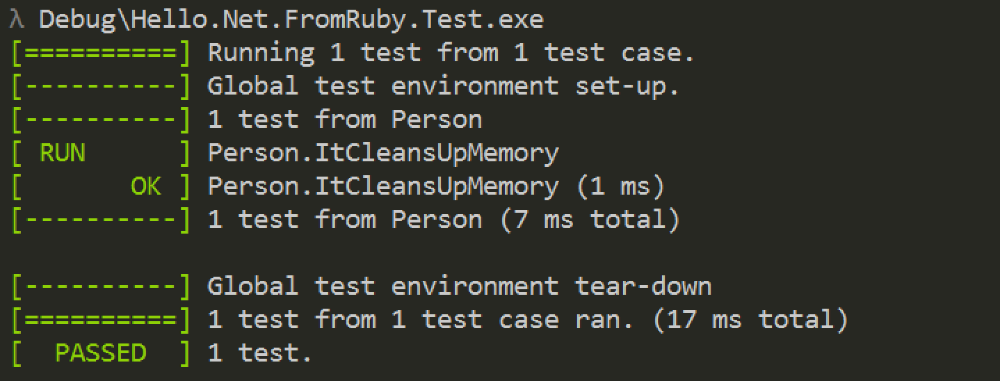

# Invoking .NET from Ruby

## Why I do it

From time to time you may find yourself with the need to call into .NET from Ruby. Personally, I find myself doing so in my automation test 
suites for .NET applications that we drive using `cucumber` and [`mohawk`](https://github.com/leviwilson/mohawk). 
Generally I do so in either some setup or cleanup hooks with `cucumber` if I need to do something outside of the UI. [`uia`](https://github.com/northwoodspd/uia) 
itself (the underlying driver for `mohawk`) makes use of this technique to hook into [Microsoft UI Automation](http://msdn.microsoft.com/en-us/library/ms747327.aspx) 
to drive Windows applications from ruby. In this post I will go over the way in which we can set this up.

## Moving Parts

There are a couple of manners in which you can achieve this. One is using something like [`IronRuby`](https://ironruby.codeplex.com/), which is a .NET implementation of the 
ruby programming language, but this seemed like overkill for my needs. Additionally, development on IronRuby seems to have been non-existent for a few years and there are limitations as to what version of ruby that you can use with it.

Another manner is to use a Managed C++ DLL as a wrapper and calling into it using the [`Ruby-FFI`](https://github.com/ffi/ffi) gem. This is the technique that we will be discussing in this article.

## The Wrapper

### Creating the Project

The managed C++ DLL is used to interface with ruby. To get your basic "Hello World" project setup, simply use Visual Studio to create a new C++ -> CLR project.


This will generate a C++ CLR library project that looks like the following:

```
.
│   .gitattributes
│   .gitignore
│   Hello.Net.FromRuby.sln
│
└───Hello.Net.FromRuby
        app.ico
        app.rc
        AssemblyInfo.cpp
        Hello.Net.FromRuby.cpp
        Hello.Net.FromRuby.h
        Hello.Net.FromRuby.vcxproj
        Hello.Net.FromRuby.vcxproj.filters
        ReadMe.txt
        resource.h
        Stdafx.cpp
        Stdafx.h
```

By default, this will create a manged C++ library project with nothing in the `Hello.Net.FromRuby.h` and `Hello.Net.FromRuby.cpp` with a managed class definition in it.

### Hello World

To get our "Hello, world!" application rolling, we simply need to export a method that we will be able to call from ruby. Modify the `.h` and `.cpp` files to look like the following:

```c++
// Hello.Net.FromRuby.h
#pragma once

using namespace System;

extern "C" {
  _declspec(dllexport) void Hello_DotNet_FromRuby(const char* message);
}
```

```c++
// Hello.Net.FromRuby.cpp
#include "stdafx.h"

#include "Hello.Net.FromRuby.h"

void Hello_DotNet_FromRuby(const char* toWhom) {
  Console::WriteLine("Hello, {0}!", gcnew String(toWhom));
}
```

In order to call into our exported method from ruby, we will need to setup `ffi` like the following:

```ruby
# hello_dotnet_fromruby.rb
require 'ffi'

module Library
  extend FFI::Library

  ffi_lib File.join(File.dirname(__FILE__), 'Debug/Hello.Net.FromRuby.dll')

  attach_function :hello, :Hello_DotNet_FromRuby, [:string], :void
end
```

After you've saved `hello_dotnet_fromruby.rb` you can run it in `irb` like so:

```
λ bundle exec irb --noprompt          
load 'hello_dotnet_fromruby.rb'       
true                                  
Library.hello "World!"                
Hello, World!!                        
nil                                   
exit                                  
```

And BAM! We are calling `Console::WriteLine` from ruby. Wasn't that simple?

## C++ Runtime Dependency
If you are trying to run this on another machine, you may have seen the following error message when you tried to load the file:

```
λ bundle exec irb --noprompt
load 'hello_dotnet_fromruby.rb'
 load 'hello_dotnet_fromruby.rb'
LoadError: Could not open library './Debug/Hello.Net.FromRuby.dll': The specified module could not be found.

        from C:/Ruby193/lib/ruby/gems/1.9.1/gems/ffi-1.9.0-x86-mingw32/lib/ffi/library.rb:123:in `block in ffi_lib'
        from C:/Ruby193/lib/ruby/gems/1.9.1/gems/ffi-1.9.0-x86-mingw32/lib/ffi/library.rb:90:in `map'
        from C:/Ruby193/lib/ruby/gems/1.9.1/gems/ffi-1.9.0-x86-mingw32/lib/ffi/library.rb:90:in `ffi_lib'
        from hello_dotnet_fromruby.rb:6:in `<module:Library>'
        from hello_dotnet_fromruby.rb:3:in `<top (required)>'
        from (irb):2:in `load'
        from (irb):2
        from C:/Ruby193/bin/irb:12:in `<main>'
```

One of two things can be causing this. Either the actual path to the `Hello.Net.FromRuby.dll` is not actually there, or the machine that you're running this on does not 
have the Microsoft C++ Runtime installed. You will need either the [2012](http://www.microsoft.com/en-us/download/details.aspx?id=30679) or [2010](http://www.microsoft.com/en-us/download/details.aspx?id=5555) redistributable, depending on which Visual Studio version you built it with.

## FFI Tips & Tricks
The initial `"Hello, World!"` function isn't terribly interesting. It's a `void` method that takes a `const char*` type and prints it out. Most of the time we will 
want to return more interesting information than this. For me, I have found that returning C++ `struct` pointers to be the easiest way to manage the information that 
we are returning information into ruby from C++. Using a `struct` makes memory management much simpler in my opinion. Let's take a look at setting this up.

### Defining Your `struct`
First, we will setup our `struct` on the C++ side of things. We will define a `struct` that returns a grab-bag of information. Here is what this looks like:

```cpp
// Person.h

#pragma once

#include "Stdafx.h"
#include "StringHelper.h"

using namespace System;

typedef struct _Person {
  bool IsMale;
  int Age;
  char* Name;
  char** Languages;
  int LanguagesLength;

  _Person(bool isMale, int age, String^ name, ...array<String^>^ languages) {
    IsMale = isMale;
    Age = age;
    Name = StringHelper::ToUnmanaged(name);

    if( languages->Length > 0 ) {
      Languages = new char*[languages->Length];
      LanguagesLength = languages->Length;
    }

    auto languageIndex = 0;
    for each(auto language in languages) {
      Languages[languageIndex++] = StringHelper::ToUnmanaged(language);
    }
  }

} Person, *PersonPtr;
```

We have defined a constructor for the `Person` `struct` that takes in all of the information that we need. Note that we can use .NET types in this, but we need to map 
these back to C++ constructs. I've also included a `StringHelper` class definition that maps between .NET `String^` types and `char *` types.

```cpp
#pragma once

#include "Stdafx.h"
#include <string>

using namespace System::Runtime::InteropServices;

ref class StringHelper
{
public:
  static void CopyToUnmanagedString(String^ source, char* destination, const int destinationSize)
  {
    auto unmanagedString = Marshal::StringToHGlobalAnsi(source);
    strncpy_s(destination, destinationSize, (const char*)(void*)unmanagedString,  _TRUNCATE);
    Marshal::FreeHGlobal(unmanagedString);
  }

  static char* ToUnmanaged(String^ source)
  {
    if( nullptr == source ) return NULL;

    const int numberOfBytes = source->Length + 1;
    auto unmanagedString = new char[numberOfBytes];
    CopyToUnmanagedString(source, unmanagedString, numberOfBytes);
    return unmanagedString;
  }
};
```

To use this, let's export another method from our DLL.

```cpp
// ... Hello.Net.FromRuby.h
__declspec(dllexport) PersonPtr Get_Information();
// ...

// ... Hello.Net.FromRuby.cpp
_declspec(dllexport) PersonPtr Get_Information() {
  return new Person(true, 34, "Joe Johnston", "English", "Spanish", "Danish");
}
// ...
```

Let's see what this looks like on the `FFI` side of things.

```ruby
module Library
  class Person < FFI::Struct

    # this layout needs to match exactly with the C++ side
    layout :is_male, :bool,
           :age, :int,
           :name, :string,
           :languages, :pointer,
           :number_of_languages, :int

    def male?
      self[:is_male]
    end
    
    def age
      self[:age]
    end
    
    def name
      self[:name]
    end
    
    def languages
      # read the char ** individually
      self[:number_of_languages].times.collect do |index|
        pointer = (self[:languages] + (index * FFI::Type::POINTER.size)).read_pointer
        pointer.read_string
      end
    end
    
    end
  end
    
  attach_function :get_information, :Get_Various_Information, [], Person.by_ref
end
```

After everything is wired up correctly, we should be able to invoke the method now from `irb`.

```
λ bundle exec irb --noprompt                                                                                                     
load 'hello_dotnet_fromruby.rb'                                                                                                  
true                                                                                                                             
info = Library.get_information                                                                                                   
#<Library::Person:0x3811068>                                                                                                     
info.methods                                                                                                                     
[:male?, :age, :name, :languages, ...]
info.male?                                                                                                                       
true                                                                                                                             
info.age                                                                                                                         
34                                                                                                                               
info.languages                                                                                                                   
["English", "Spanish", "Danish"]                                                                                                 
exit                                                                                                                             
```

### Memory Management
You may have noticed a slight problem with our implementation. Where is the memory management? We're allocating memory on the C++ side of things not only for the 
`Person struct`, but even within the `struct` we are allocating memory for the `Name` field as well as any `n` number of languages that were passed into the constructor. 
Luckily, `FFI` has a nice way to manage this with an `FFI::ManagedStruct`. With the `FFI::ManagedStruct`, you simply define a `self.release` method that will get called 
when the ruby object gets garbage collected. You just provide a C++ method to call when this happens that knows how to free up your memory.

In the example above, here is how we would augment the `Person` class on the ruby side to handle this:

```ruby
module Library
  class Person > FFI::ManagedStruct
    # ... same layout as above
    
    def self.release(pointer)
      Library.release_person(pointer)
    end
  end

  attach_function :release_person, :Release_Person, [:pointer], :void
end
```

```cpp
// ...
// Hello.Net.FromRuby.h
__declspec(dllexport) void Release_Person(PersonPtr myStruct);

// Hello.Net.FromRuby.cpp
void Release_Person(PersonPtr myStruct) {
  delete myStruct;
}
// ...
```

```cpp
// Person.h
typedef struct _Person {
  // ...
  ~_Person() {
    Console::WriteLine("Releasing person {0}", gcnew String(Name));
  }
} Person, *PersonPtr;
```

```
λ bundle exec irb --noprompt       
load 'hello_dotnet_fromruby.rb'    
true                               
Library.get_information            
#<Library::Person:0x37b8d60>       
exit                               
Releasing person Joe Johnston
```

When we run this, we can see that when the ruby object is garbage collected it will automatically call our `Person#release` method which will call `delete` on the `Person*` that was returned to us. We still have memory leaks, but the next section will clear that up for us.

### Unit Testing / Memory
Though it is pretty straightforward to add memory management, admittedly it is something that I tend to forget when I'm wiring up my library to `FFI`. Additionally, it felt 
a little dirty to me that we don't have any unit tests for our application. With this, we can kill two birds with one stone. Luckily there are a couple of really good 
testing frameworks for C++. Two of my personal favorites are [CppUTest](http://cpputest.github.io/) (written by [James Grenning](http://twitter.com/jwgrenning)) and [gtest](https://code.google.com/p/googletest/) and [gmock](https://code.google.com/p/googlemock/) (maintained by Google). Both are really solid testing frameworks and fortunately we can test our memory usage with it to make sure we are not being jerks with it. Both frameworks have a similar style to define tests, in this post I will talk about how to test using `gtest`.


#### gtest
To get started using `gtest`, you can download the [latest version here](https://code.google.com/p/googletest/downloads/list). You will need to compile it on your own. This 
should be pretty straightforward, but you will run into one issue when compiling through Visual Studio. It is described [in more detail here](http://stackoverflow.com/a/12558470/596146), 
but you will basically need to set the preprocessor variable `_VARIADIC_MAX=10` for it to compile. In addition to this, since we are testing a C++ library that requires the `/clr` switch, we'll need to build `gtest` to use the dynamic version of the C Runtime (`/MDd` / `/MT` for Debug / Release). Once you've gotten that out of the way, begin by creating a new Win32 
Console application project and enabling the `/clr` switch. Copy the `include`, `gtestd.lib` and `tgest.lib` (Debug and Release) somewhere into your project. I usually put it in a `vendor` folder. Here is what your `main` should look like:

```cpp
#include <gtest\gtest.h>

TEST(Hello, GoogleTest) {
  ASSERT_TRUE(true);
}

int main(int argc, char* argv[]) {
  ::testing::InitGoogleTest(&argc, argv);
  return RUN_ALL_TESTS();
}
```




#### Memory Leak Detection
In order to detect memory leaks, you can extend `gtest` with a new listener. [Stephan Brenner](https://github.com/ymx/gtest_mem) has a project where he includes such a listener that verifies that after each test has finished running that it hasn't leaked any memory. By adding the `MemoryLeakDetector.h` to our project and then modifying our test, we can now verify that our `~_Person` destructor is still not cleaning up after itself:

```cpp
#include "MemoryLeakDetector.h"

TEST(Person, ItCleansUpMemory) {
  auto person = Person(true, 123, "The name", "English");
  // ~Person called after the test has completed
}

```




Once we add the proper cleanup of our Person class, we now see that the tests are passing and we can continue to add more.

```cpp
// ... Person.h
~_Person() {
  // clean up the Name
  delete[] Name;

  // clean up each Language
  for(auto index = 0; index < LanguagesLength; ++index) {
    delete[] Languages[index];
  }

  // clean up Languages**
  delete[] Languages;
}
```



## Conclusion
Though there are a few moving parts, bridging the gap between .NET and ruby is not terribly difficult. Here we have put together a sample application that illustrates how one would setup a C++ dll to call into the .NET framework from ruby. In some future posts I'd like to dive more into some more tips and tricks that I have learned in my development of the [`uia`](https://github.com/northwoodspd/uia) library such as:

* Exception handling
* Writing your own C# helper assemblies and having it load correctly
* Some more advanced FFI calls between ruby / C++ such as calling variadic functions

### The Codez
All of the code for this post [can be found here](https://github.com/levi-examples/Hello.Net.FromRuby/commits/master).

